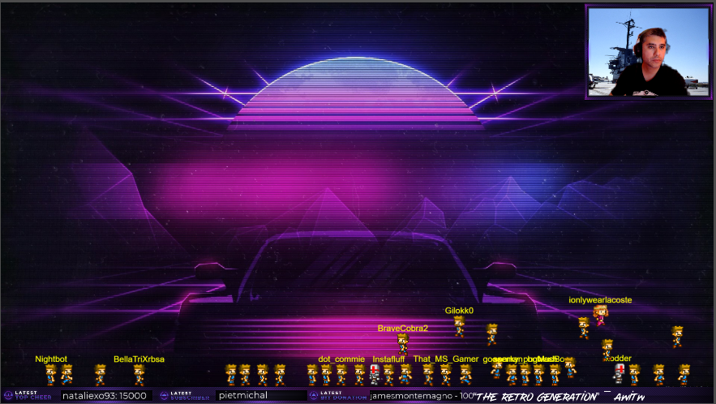

# [Twitch Interactive Chat Overlay](https://example.com/)



Twitch Interactive Chat Overlay is a simple and fun overlay to add to your stream that gives chat a new way to interact with you and fellow members of chat. Every person in the chat is reperesented by a sprite on the screen they can control. Doing the `!controls` command will display a dialog on the screen of the various command they can do to controls their sprite. Also doing `!audio` will display the commands they can use to trigger audio queues that are backed into the overlay. It's just some simple silly that can be had with out the need of any servers or logging into a website to use.

This project is for refernece and sprite assets have been licensed by me. If you would like to fork this repository, you must obtain a license to use sprite assets or replace them with your own.

---
# Features:
- All users in your chat get their own sprite
- Only users the talk in chat will have their names displayed
- Connect to any Twitch channel
- Reacts to cheer, sub and resub events
- Requires no server
- !controls
- !audio


# How do I use the overlay on my stream?

Adding the overlay to your stream is super simple!

1. Add the following link as you browser source to your streaming software (like OBS): [https://talk2megooseman.github.io/twitch-interactive-overlay/?channel=YOUR_CHANNEL_NAME_HERE](https://talk2megooseman.github.io/twitch-interactive-overlay?channel=YOUR_CHANNEL_NAME_HERE)

2. Change the YOUR_CHANNEL_NAME_HERE in the url to match your channel's name like the following: https://talk2megooseman.github.io/twitch-interactive-overlay/?channel=talk2megooseman

3. Type `!commands` or `!audio` to see a list of commands on screen

---

# Interested in doing development on the project?

Follow the instructions below and start developing your games right away.

## First steps

Run your project with `yarn start`.


## Package Scripts

The following package scripts are also available to manage your project:

```sh
yarn clean     # Manually deletes previous distribution files.
yarn format    # Uses ESLint to format and remove lint issues.
yarn lint      # Checks scripts for lint issues using ESLint.
```

## Tutorial

No idea of what to do next? Follow this [tutorial][t] and learn more about
Phaser 3 and `generator-phaser-plus`.

[t]: https://github.com/rblopes/generator-phaser-plus#a-brief-tutorial


